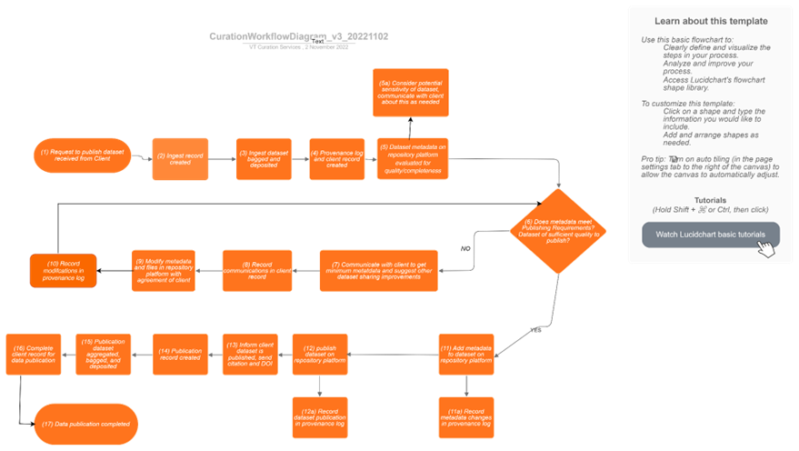

- [Overview of Curation workflow for Data Management and Curation Services](#overview_of_curation_workflow_for_data_management_and_curation_services)
- [Getting Started](#getting_started)
- [Description of the workflow](#description_of_the_workflow)
- [Overview of the workflow with curation diagram](#overview_of_the_workflow_with_curation_diagram)
- [Running Batch Codes](#running_batch_codes)
- [git pull tips](#git_pull_tips_for_local_changes)

<a id="overview_of_curation_workflow_for_data_management_and_curation_services"></a>
# Overview of Curation workflow for Data Management and Curation Services

The scripts in the folder **Figshare-APTrust** show the workflow set up by [Virginia Tech Data Repository](https://data.lib.vt.edu/) to download and deposit bags to aptrust via [DART](https://aptrust.github.io/dart-docs/users/workflows/). Virginia Tech Data Services uses a simple client for the figshare API in python from [Cognoma](https://github.com/cognoma/figshare), parts of [LD-Cool-P from University of Arizona workflow]( https://github.com/padmacarstens/LD-Cool-P), and [Scripting with DART](https://aptrust.github.io/dart-docs/users/scripting/). VTDR runs on the figshare for institutions platform.

The scripts in the folder **APTrustBagTransferAndmd5Verification** show the checksum verifications, bag validations performed on existing figshare bags stored in a previous storage location (not APTrust), and re-bagging scripts used to transfer the existing figshare bags(~2TB) to APTrust.

The workflow scripts in the folder **Figshare-APTrust** creates folders for [VTDR](https://data.lib.vt.edu) articles in-review (ingest content: before curator-client interactions) and after review(published content: after curator-client interactions). The content is then bagged in tarred format using APTrust bagit profile and tag values using DART app([Scripting with DART](https://aptrust.github.io/dart-docs/users/scripting/)). Part of the bagging for published content involves creation of ArchivalReadme.rtf file, README.rtf file, and addition of emails, ProvenanceLog.rtf by the curator. The bagged content is then transferred to APTrust via their [DART](https://aptrust.github.io/dart-docs/users/workflows/) and/or Virginia Tech Libraries storage. [APTrust registry](https://aptrust.org/documentation-page/registry/) checks are made to avoid overwriting existing bags. APTrust performs fixity checks on these bags at regular intervals. 

Detailed documentation on how to set up a Windows/Mac environment to use these codes is available at:
[ScriptsSetupAndExecution_CurationWorkflow_Windows.docx](https://github.com/VTUL/VTDR_RepositoryServices/blob/main/ScriptsSetupAndExecution_CurationWorkflow_Windows.docx)
[ScriptsSetupAndExecution_CurationWorkflow_Mac.docx](https://github.com/VTUL/VTDR_RepositoryServices/blob/main/ScriptsSetupAndExecution_CurationWorkflow_Mac.docx)

<a id="getting_started"></a>
# Getting Started

Detailed instructions for environment setup are at:
[Setting up environment for Mac](https://github.com/VTUL/VTDR_RepositoryServices/blob/main/ScriptsSetupAndExecution_CurationWorkflow_Mac.docx)
[Setting up environment for Windows](https://github.com/VTUL/VTDR_RepositoryServices/blob/main/ScriptsSetupAndExecution_CurationWorkflow_Windows.docx)

Overview of environment setup:

* Download [Anaconda Distribution for Windows/Mac](https://www.anaconda.com/download/success)
* Download [Visual Studio Code for Windows/Mac](https://code.visualstudio.com/download)
* Download [git](https://git-scm.com/downloads)
* Create a curation environment in conda using python 3.9 version and activate it:

```
conda create -n curation python=3.9
conda activate curation
```

Clone [VTDR Repository](https://github.com/VTUL/VTDR_RepositoryServices) from [VTUL github](https://github.com/VTUL)
* Create a token in [VTDR](https://data.lib.vt.edu/)
* Open generate_config_example.py from 'Figshare-APTrust' folder, and save it as 'generate_config.py' in the 'curation' folder. Fill in the credentials. Details on filling these credentials are available [here](https://github.com/VTUL/VTDR_RepositoryServices/blob/main/ScriptsSetupAndExecution_CurationWorkflow_Mac.docx) for mac, and [here](https://github.com/VTUL/VTDR_RepositoryServices/blob/main/ScriptsSetupAndExecution_CurationWorkflow_Windows.docx) for windows
* Download [APTrust Partner Tools](https://aptrust.github.io/userguide/partner_tools/). Details on accessing apt-cmd.exe are available [here](https://github.com/VTUL/VTDR_RepositoryServices/blob/main/ScriptsSetupAndExecution_CurationWorkflow_Mac.docx) for mac, and [here](https://github.com/VTUL/VTDR_RepositoryServices/blob/main/ScriptsSetupAndExecution_CurationWorkflow_Windows.docx) for windows
* To access google sheets, curator needs google sheets api key. Download and save client_secret.json in the curation folder. 
* Download [DART tool](https://aptrust.github.io/dart-docs/download/) to deposit content to APTrust. Fill in the credentials in the DART tool following [these instructions](https://github.com/VTUL/VTDR_RepositoryServices/blob/main/DARTSetup_APTrust_VTLibS3Setup_CurationWorkflow.docx)


<a id="description_of_the_workflow"></a>
# Description of the workflow: 

**Note** : For the curation workflow, only the scripts in **'Fighsare-APTrust'** folder are used.

Workflow diagram with detailed description of each block is available at:
[Curator workflow detailed documentation with workflow diagram](https://github.com/VTUL/VTDR_RepositoryServices/blob/main/CuratorWorkflowDiagramWithScriptExecution_v2_20231108.docx)

<a id="overview_of_the_workflow_with_curation_diagram"></a>
# Overview of the workflow with curation diagram: 



Above is the curation workflow diagram by __Jonathan Petters__. Following is the overview of each step of the diagram:

**Step 1** Request to publish dataset received from Client in the email.

**Step 2** ‘Ingest record created’ and **Step 3** ‘Ingest dataset bagged and deposited’:
* [VTDR](https://data.lib.vt.edu/) figshare 'item in review' metadata i.e. requestor, author, version, date, title, article id and email is entered in VTDR curation spreadsheet. 
* article id is entered in generate_config.py, run this script to create configurations.ini file.
* run IngFolder_Download_TransferBagAPTrust.py to create an ingest folder. The ingest folder contains 'in review' article metadata and files downloaded from figshare. These are then deposited to aptrust in tar format using DART app.

**Step 4** Provenance log and client record created: These are done manually by the curator. Provenance log is added to the ingest folder created in step 3 above. Provenance log contains interactions between the client and the curator, along with the date and curator name. This file is in rtf format. Client record is created in [VTUL LibCRM](https://vt.libapps.com/libapps/login.php?site_id=17108&target=/). Details on recording are found [here](https://github.com/VTUL/VTDR_RepositoryServices/blob/main/CuratorWorkflowDiagramWithScriptExecution_v2_20231108.docx)

**Step 5** Dataset metadata on repository platform evaluated for quality/completeness 
Article is reviewed using the edit item interface in the review page of [VTDR](https://data.lib.vt.edu/). 

**Step 6** Does metadata meet Publishing Requirements? Dataset of sufficient quality to publish?
In this step, the curator decides either to continue with publication of the dataset or to decline the dataset depending on the [VTDR publishing and depositing guidelines](https://guides.lib.vt.edu/VirginiaTechDataRepository/About)	

**Step 7** Communicate with client to get minimum metadata and suggest other dataset sharing improvements
Curator exchanges emails with the client for improvements to their research dataset.

**Step 8** Record communications in client record:	
Client record created in step 4 is updated based on the interactions by the curator.

**Step 9** Modify metadata and files in repository platform with agreement of client:	
Clients record is updated on [VTDR](https://data.lib.vt.edu/) using edit item interface, based on the interactions/suggestions by the curator

**Step 10** Record modifications in Provenance log:	
Provenance log created in step 4 is updated by the curator

**Step 11** Add metadata to dataset on repository platform and Step(11a): Record metadata changes in provenance log:	
* Run the script CreateUploadReadme.py to create a README file and upload to the client's record. 

**Step 12** Publish dataset on repository platform and step (12a) Record dataset publication in provenance log:	
Item is published on [VTDR](https://data.lib.vt.edu/) 

**Step 13** Inform client dataset is published, send citation and DOI
Client is updated via email. Email interactions are saved as pdf files

**Step 14** Publication record created	and **Step 15** Publication dataset aggregated bagged, and deposited:	
Published article metadata is recorded in VTDR spreadsheet. 
* Run PubFolder_Download.py to download published article metadata and files. 
* Add ProvenanceLog.rtf, email interactions to the folder created above.
* Run PubBagDART_TransferBagAPTrust.py to upload this to APTrust/VTUL S3/local Sandisk following the options in this script. 

**Step 16** Complete client record for data publication

Workflow is complete.


<a id="running_batch_codes"></a>
# Running Batch Codes:

From the Explorer on the left side in VSCode, open generate_config_batch_example.py and save it as generate_config_batch.py. Fill in only the values of the credentials from generate_config.py. Please note that copying lines from generate_config.py to generate_config_batch.py changes formatting, and causes errors. In order to avoid this, copy paste only the values. For Eg: for figshare token, copy the token value only, and paste it in generate_config_batch.py.
The only new addition will be the path to the curation services actions folder where emails are to be saved:

    VTCurSerFoldPath="/Users/padma/opt/anaconda3/envs/curation/test"

Make a new folder in 'curation' folder called 'test'(or whatever you want to name it, make sure to change it above as well if other than 'test') and move the contents of curation services actions(emails etc.) to this folder.

Open AutomateProvenanceLog_Batch.py and fill in the curator/description. Save the file. 
 
Open downloadFigshareContent_batch.py

Provide the article ids on the first line in this code:
```
FigshareArticleID=["212121","5453543","32232"]
```
Add more ids or replace with the article ids for the ingest/publication content. 
Run downloadFigshareContent_batch.py
Pick 1 for Ingest, 2 for Pub
Pick 1 for demo, 4 for repo

Run downloadFigshareContent_batch.py
(For the error bs4 not found, please do "pip3 install BeautifulSoup4")
Pick 1 for Ingest 2 for Pub
Pick 1 for demo 4 for repo

Make sure "curation" environment is activated. Ctrl+Shift+P, Select Python Interpreter, pick 'curation'.

Note: 
1. README file is created in the path provided in the configurations, with a date stamp addition in order to avoid overwriting
2. README file is uploaded to the client's account after the ingest record is created and transferred to aptrust

<a id="git_pull_tips_for_local_changes"></a>
## git rebase for accomodating changes made locally, and main being ahead of local:

- Commit local changes:

```
cd VTDR_RepositoryServices
git status
git add --all
git commit -m 'localchanges'
```

- Checkout remote repositor:

See if remote is named 'origin' or get the name for the remote branch:
```
git remote -v 
git checkout origin
```

- Rebase local changes with the ones in the remote: 
```
git rebase main
```

-Checkout local and merge with remote:
```
git checkout main
git merge origin
```